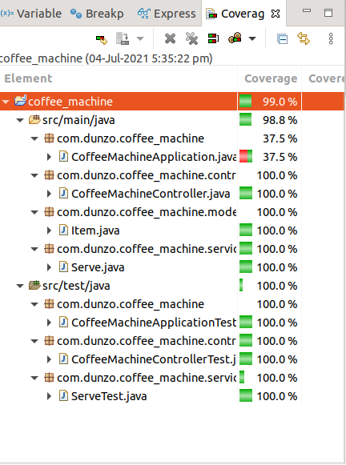

<h1>Coffee Machine</h1>

Start it as a springboot application

<h3>Rest Endpoint</h3>

1. Base Path - http://localhost:8080/serve
2. Method - POST
3. Headers - 
	Content-Type:application/json
4. Body example - 
	raw/json
<code> 
	{
  	  "machine": {
  	    "outlets": {
  	      "count_n": 4
  	    },
  	    "total_items_quantity": {
  	      "hot_water": 500,
  	      "hot_milk": 500,
  	      "ginger_syrup": 100,
  	      "sugar_syrup": 100,
  	      "tea_leaves_syrup": 100
  	    },
  	    "beverages": {
  	      "hot_tea": {
  	        "hot_water": 200,
  	        "hot_milk": 100,
  	        "ginger_syrup": 10,
  	        "sugar_syrup": 10,
  	        "tea_leaves_syrup": 30
  	      },
  	      "hot_coffee": {
  	        "hot_water": 100,
  	        "ginger_syrup": 30,
  	        "hot_milk": 400,
  	        "sugar_syrup": 50,
  	        "tea_leaves_syrup": 30
  	      },
  	      "black_tea": {
  	        "hot_water": 300,
  	        "ginger_syrup": 30,
  	        "sugar_syrup": 50,
  	        "tea_leaves_syrup": 30
  	      },
  	      "green_tea": {
  	        "hot_water": 100,
  	        "ginger_syrup": 30,
  	        "sugar_syrup": 50,
  	        "green_mixture": 30
  	      }
  	    }
  	  }
	}
</code>

<h3>Coverage</h3>
 

